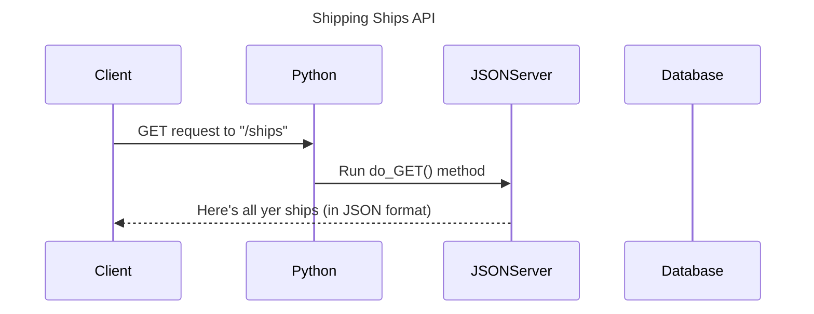

```mermaid
sequenceDiagram
    title Shipping Ships API

    participant Client
    participant Python
    participant JSONServer
    participant Database

    Client->>Python: GET request to "/ships"
    Python->>JSONServer: Forward GET /ships
    JSONServer->>Database: Query ship data
    Database-->>JSONServer: Return ship records
    JSONServer-->>Python: JSON response with ship data
    Python-->>Client: Return JSON with list of ships